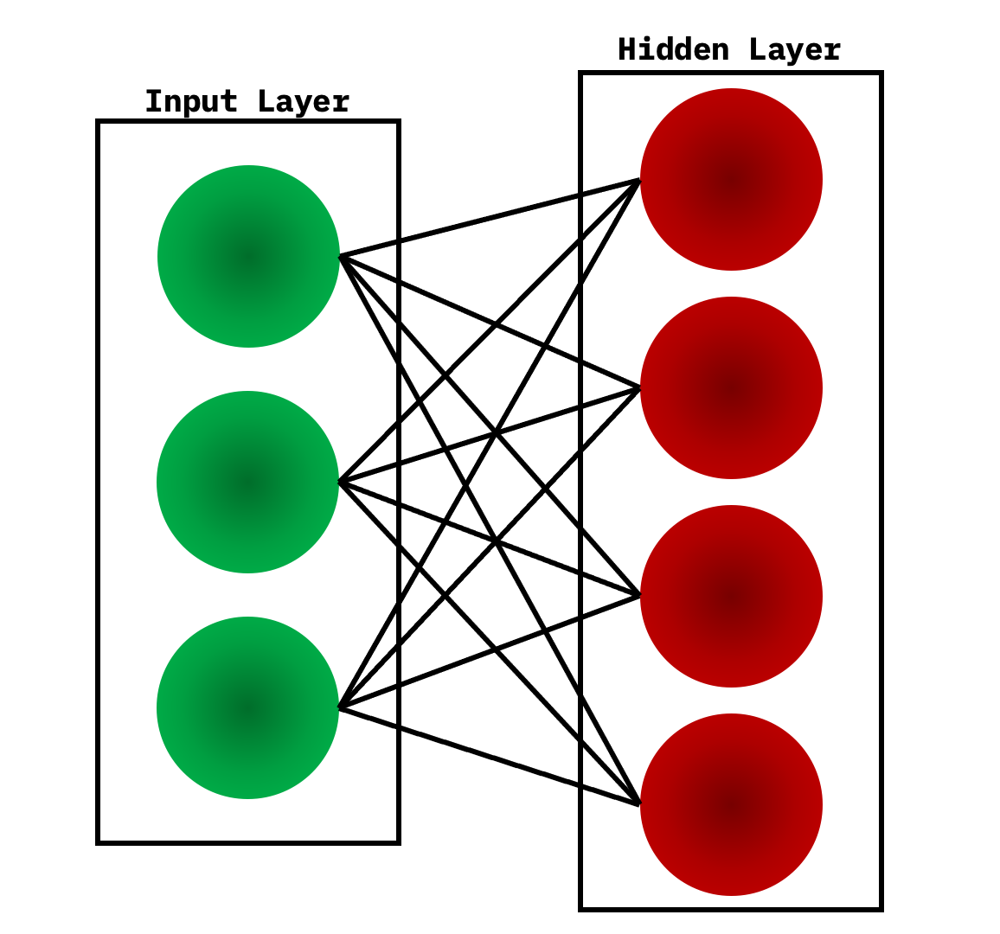
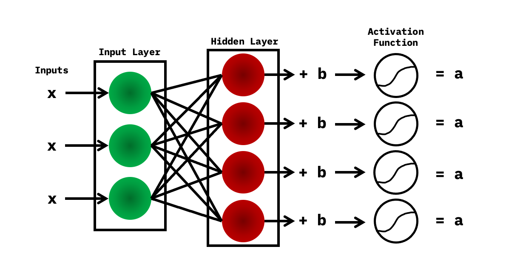
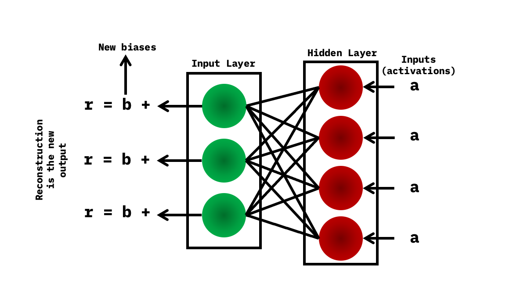

# Build a Recommendation Engine with a Restricted Boltzmann Machine using TensorFlow
In this code pattern we are going to build a Restricted Boltzmann Machine using TensorFlow which will give us recomendations based on movies which have been watched already. The datasets we are going to use are acquired by <a href="http://grouplens.org/datasets/movielens/">GroupLens</a> and consists of movies, users and movie ratings by these users. We are using a sigmoid activation function for the nueral network and the reccomendations are given based on the reccomendation score generated by a Restricted Boltzmann Machine (RBM).

## What is a Restricted Boltzmann Machine (RBM)?
But before we start, lets talk a bit about the basics of RBM. A RBM is a two-layered (input layer and hidden layer) artifical nueral network which learns a probability distribution based on a set of inputs, it is a stochastic (non-deterministic) which helps us solve different cobmination based problems. RBM's can be used for dimensionality reduction, classification, regression, collaborative filtering, feature learning, and topic modeling.

As the name suggests, RBM is a class of Boltzmann machines, but they are restricted in certain ways when considering the connections between the input and the hidden nodes of the Neural Network, and thus it is easier to implement a RBM than a Boltzmann machine. The layers and the nodes within those layers are are connected to each other in a one-to-many fashion where each node in the input layer is connected to each and every node in the hidden layer, but no node within each layer is connected to each other. The restriction gives the opportunity for more streamlined training algorithms than what is generally used in Boltzmann machines.

This is how an RBM looks like, as you can see all the nodes in the input layer are connected to the each node in the hidden layer, and the structure of the Neural Network itself makes it efficient when it comes to training our Neural Network as one input layer can use many hidden layers for training. Multiple RBM's can be stacked on as well creating a Deep Belief Network which will allow more deeper learning of the neural network and incorporate further learning.

## How does a Restricted Boltzmann Machine (RBM) work?

There are two steps involved when it comes to the working of a RBM:
- Multiple Inputs
- Reconstruction

#### Multiple Inputs

Multiple inputs is considered to be the first step when it comes to the training of the Neural Network, the inputs are taken into the input layer, multiplied by the wieghts and is added to the bias. After which it goes through the activation function (sigmoid) and thus the outputs decide if the hidden state gets activated. 

The weights in the nueral network are in a matrix, where the number of input nodes is the number of rows and the number of hidden nodes is the number of columns. Furthermore, the primary hidden node will obtain the vector multiplication of the inputs and will be multiplied by the first column of weights before the corresponding bias term is added to it.

#### Reconstruction

In reconsutection the logic is pretty simple, we habe the activations which are the inputs at this point, which are then passed to the hidden layer and then to the input later after which new biases are obtained and the reconstruction is the new output.

**So how does the learning process really work?** As these two steps happen subsequently, where forst we generate activations using multiple inputs phase and then reconstruction takes place, when the reconstruction is taking place in an epoch, our main goal here is to decrease the reconstuction error, thus the weights are then adjusted per-iteration accordingly by the algorithm to decrease the reconstruction error which will result in giving us a good prediction/higher accuracy.

## Where else is RBM used?

- Recommendation Systems
- Representation Learning (Feature Learning)
- Image Recognition
- Natural Language Understanding (Deep Belief Network)

## Lets Get Started

1. Sign up or log in.

    * Activate Watson Studio by logging in to your IBM Cloud account from the [Try IBM Watson](https://dataplatform.cloud.ibm.com/registration/stepone?cm_sp=ibmdev-_-developer-tutorials-_-cloudreg) page.
    * Access Watson Studio, by logging in at [https://dataplatform.cloud.ibm.com](https://dataplatform.cloud.ibm.com?cm_sp=ibmdev-_-developer-tutorials-_-cloudreg).

1. Create an empty project.

    * Click either **Create a project** or **New project**.
    * Select **Create an empty project**.
    * Give the project a name.
    * Choose an existing Object Storage service instance or create a new one.
    * Click **Create**.

1. Add the Notebook.

   * Click **+Add to project**.
   * Click **Notebook**.
   * Click **From URL**.
   * Provide a **Name**.
   * Under **Select runtime**, choose **Default Python 3.6 Free**.
   * Enter `https://raw.githubusercontent.com/fawazsiddiqi/recommendation-system-with-a-Restricted-Boltzmann-Machine-using-tensorflow/master/notebooks/CollaborativeFilteringwithRBM.ipynb` as the **Notebook URL**.
   * Click **Create Notebook**.

1. Run the Notebook.

   In the open Notebook, click **Run** to run the cells one at a time. The rest of the tutorial follows the order of the Notebook.
